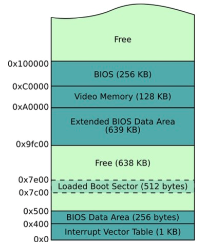

# 实验1：接管裸机的控制权

## 一. 实验目的
- 了解裸机启动的过程
- 体验裸机编程

## 二. 实验内容
- 构建虚拟机
- 制作软盘
- 设计**引导扇区程序**

## 三. 相关原理
### 1.引导扇区
**磁盘的第一个扇区称为引导扇区，其中放置主引导程序，用于加载并转让处理器控制权给操作系统。** 磁盘以扇区为单位，一个扇区的大小是512字节。  

系统在开机时会读取磁盘，而且电脑还可以读取虚拟的软盘，可以使用映像文件来作为软盘。系统检测到磁盘或虚拟软盘的存在后，就会**将其首扇区(即引导扇区)读入到内存中从 07c00h 开始的 512 个字节(如下图)** 并跳转到 07c00h 处执行主引导程序。

因此我们以无操作系统的虚拟机作为裸机，以映像文件作为软盘来模拟裸机上的程序控制这个过程。
<div align=center>

</div>

## 四. 实验方案
**将引导扇区程序写入软盘首扇区**后运行虚拟机，虚拟机将自动读取引导扇区到内存，并运行引导扇区程序。

### 文档清单
```bash
:.
│   readme.md
│   实验报告1.pdf
│
├─原程序文件及可执行文件
│       pro1.asm		# 引导程序
│       pro1.bin		
│
└─虚拟机软盘映像文件
        pro1.img
```

### 编译命令
```
nasm pro1.asm -o pro1.bin
```

### 程序关键模块
引导程序开头。
```x86asm
org 07c00h		; 定义程序的起始地址
```

-------------------------------------
### 引导程序额外功能：屏幕显示
设置屏幕像素，达到显示的效果。(见实验报告)  
内存B8000h到BFFFFh为字符方式显存地址，显存上的字节将显示在屏幕上的对应位置。
```x86asm
start:
    mov ax,0B800h		; 文本窗口显存起始地址
    mov gs,ax			; GS = B800h
......
show:
    ......
    mov si,ax                   ; ax = 2*(80*x+y) 表示第x行第y列
    mov byte[gs:si],'A'  	; 显示字符的ASCII码值
    mov byte[gs:si+1],13        ; 字符属性
```