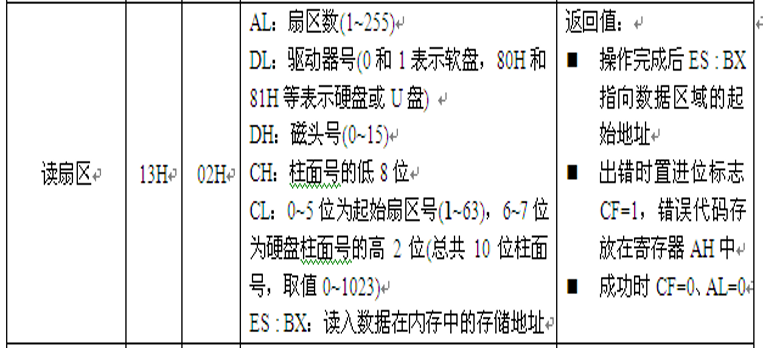

# 实验2：加载用户程序的监控程序

## 一. 实验目的
- 掌握BIOS的中断调用方法。
- 开发原始操作系统。开发监控程序，通过键盘输入控制用户程序执行。

## 二. 实验要求
- 设计四个有输出的用户程序。
- 设计引导程序，作为监控程序，用于指定用户程序运行。

## 三. 相关原理
### BIOS
BIOS是英文"Basic Input Output System"的缩略语，直译过来后中文名称就是"基本输入输出系统"。

其实，**BIOS是一组固化到计算机内主板上一个ROM芯片上的程序**，它保存着计算机最重要的基本输入输出的程序、系统设置信息、开机后自检程序和系统自启动程序。其主要功能是为计算机提供最底层的、最直接的硬件设置和控制。

#### BIOS芯片中主要存放：
- **系统自举装载程序**：在自检成功后将磁盘相对0道0扇区上的引导程序装入内存，让其运行以装入DOS系统；
- **主要I/O设备的驱动程序和中断服务**：BIOS直接和系统硬件资源打交道；
- CMOS设置程序：引导过程中，用特殊热键启动，进行设置后，存入CMOS RAM中；
- 自诊断程序：通过读取CMOSRAM中的内容识别硬件配置，并对其进行自检和初始化；

#### BIOS中断服务程序
是微机系统软、硬件之间的一个可编程接口，用于程序软件功能与微机硬件实现的衔接。DOS/Windows操作系统对软、硬盘、光驱与键盘、显示器等外围设备的管理即建立在系统BIOS的基础上。  
程序员也可以通过对INT 5、INT 13等中断的访问直接调用BIOS中断服务程序。

#### 调用BIOS中断服务程序的方法
- 每个中断服务有特定的参数，一般使用指定的寄存器传递参数；
- 利用软中断指令调用
- BIOS中断调用的一般格式为：
```x86asm
mov ah,功能号
…… ; 设置各种入口参数
int 中断号
```

#### 常用BIOS调用
<div align=center>

</div>

#### BIOS的13H调用
BIOS的13H提供了磁盘读写的调用；功能号等于02H时表示读扇区。
<div align=center>

</div>

#### BIOS的10H调用
BIOS的10H提供了显示字符串的调用；功能号等于13H时表示显示字符串。
<div align=center>

</div>

## 四. 实验方案
### 方案思路
设计一个主引导程序，以它作为监控程序运行。监控程序通过键盘输入选择执行的用户程序，在用户程序中通过特定输入返回监控程序。

需要自己设置用户程序在软盘以及内存中的位置。

### 关键模块
#### 显示个人信息模块： (调用10h中断)
```x86asm
Start:
	mov	ax, cs	            ; 置其他段寄存器值与CS相同
	mov	ds, ax	            ; 数据段
	mov	es, ax		        ; 置ES=DS
	mov	bp, Message		    ; BP=当前串的偏移地址
	mov	cx, MessageLength   ; CX = 串长（=9）
	mov	ax, 1301h		    ; AH = 13h（功能号）、AL = 01h（光标置于串尾）
	mov	bx, 0007h		    ; 页号为0(BH = 0) 黑底白字(BL = 07h)
    mov dh, 0000h		    ; 行号=0, 列号=0 
	int	10h			        ; BIOS的10h功能：显示一行字符
```

#### 加载用户子程序： (调用13h中断)
```x86asm
    ;读软盘或硬盘上的若干物理扇区到内存的ES:BX处：
    mov ax,cs                ;段地址 ; 存放数据的内存基地址
    mov es,ax                ;设置段地址（不能直接mov es,段地址）
    mov bx, OffSetOfUserPrg1  ;偏移地址; 存放数据的内存偏移地址
    mov ah,2                 ;功能号
    mov al,4                 ;扇区数
    mov dl,0                 ;驱动器号 ; 软盘为0，硬盘和U盘为80H
    mov dh,0                 ;磁头号 ; 起始编号为0
    mov ch,0                 ;柱面号 ; 起始编号为0
    mov cl,2                 ;起始扇区号 ; 起始编号为1
    int 13H ;                调用读磁盘BIOS的13h功能
```
#### 根据键盘输入选择子程序：(调用16h中断)
输入[1 / 2 / 3 / 4]选择子程序： 
```x86asm
    ; 用户程序a.com已加载到指定内存区域中
	mov ah,0
	int 16H
	cmp al,49
	jz OffSetOfUserPrg1
	cmp al,50
	jz OffSetOfUserPrg2
	cmp al,51
	jz OffSetOfUserPrg3
	cmp al,52
	jz OffSetOfUserPrg4
```