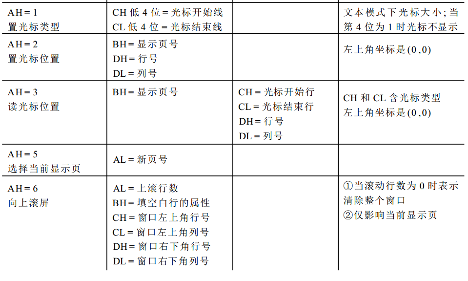
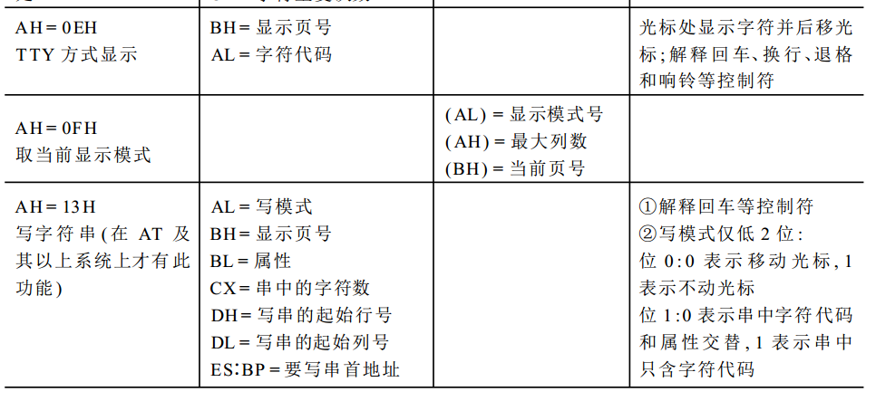

# 实验3：C与汇编混合编程

## 一. 实验目的
- 把原来在引导扇区中实现的监控程序(内核)分离成一个独立的执行体，方便后续扩展功能。
- 学习汇编与 C 混合编程技术。

## 二. 实验要求
- 监控程序以独立的可执行程序实现。引导程序 加载 监控程序(内核)；监控程序(内核) 加载 用户程序；
- 使用"汇编与 C 混合编程技术"，扩展监控程序命令处理能力。

## 三. 相关原理 (汇编与 C 混合编程)
### 【文件头注意点】
使用 16 位代码：
- 汇编模块开头加 ```[bits 16]``` 
- C 程序模块开头加```__asm__(".code16gcc")```
### 【符号与变量引用规则】
- 汇编文件引用 C 文件中的变量和函数名，需要在前面加下划线。C 文件中的变量和函数在编译后，前面都加了下划线，所以汇编文件中引用 C 文件中的变量和函数名时，要加下划线；
- C 文件引用汇编文件中变量和函数名。汇编文件中变量名和函数名前面要事先加下刬线，C 文件中才能在引用时去掉下划线。

### 【 函数调用参数传递与栈操作】
#### 汇编模块中调用C模块中的函数：
- (汇编模块中)需要先用extern声明C模块的函数。 
- 根据C函数原型，用栈传递参数，调用C函数时按后面参数先进栈的顺序压栈。
- C函数的返回值从eax寄存器中获取。
- 调用C函数后，要将栈中参数弹出。
- 进栈出栈以4字节为单位。

#### C模块中调用汇编模块中的过程和变量引用：
- 汇编模块中要先用global声明这些符号。
- 汇编模块中的过程从栈中取得参数，不必出栈，直接引用栈中的值，顺序与C进栈对应。
- 返回值需要放置在eax寄存器才能被C模块使用。
- 不确定 (C 模块中需要声明汇编模块中相应的过程和变量引用。)

### 【 Call 指令与 ret 指令具体操作】：
(忘记来源是哪了)
- call指令的具体操作 (压栈保存ip，ip跳转)
```x86asm
sp      sp-2
[sp]    ip
ip      ip+disp
```
- ret指令的具体操作 (取ip，退栈)
```x86asm
ip      [sp]
sp      sp+2
```

### 【扇区在磁盘中的位置】：
一个磁道有18个扇区。由于BIOS无法跨磁道读扇区，对扇区的位置以磁头，柱面做了区分。对第q个扇区。它在磁盘中的位置计算方法为：
```
磁头 = (q/18) % 2
柱面号 = (q/18) / 2
扇区起始号 = q % 18 + 1
```

### 【使用BIOS的10h输出中断】：
<div align=center>


</div>

## 四. 实验方案

### 汇编与 C 混合编译
#### 工具链
- GCC 编译器
- NASM 汇编器
- LD 链接器

#### 混合编译过程
使用 gcc 编译 C 程序生成 .o 文件，使用 nasm 汇编 x86 程序生成 .o 文件，使用 ld 将 .o 文件进行链接生成 .tmp 文件，使用 objcopy 命令将 .tmp 文件复制成 .bin 文件。

#### 混合编译命令
- GCC 编译命令(file.c 编译成 cfile.o)
    ```bash
    gcc -march=i386 -m32 -mpreferred-stack-boundary=2 -ffreestanding -c file.c -o cfile.o
    ```
- NASM 汇编命令(file.asm 编译成 afile.o)
    ```bash
    nasm -f elf32 file.asm -o afile.o
    ```
- LD 链接命令(链接 afile.o 与 cfile.o 为临时文件 kernel.tmp，程序将被加载到内存 0x8100)
    ```bash
    ld -m i386pe -N afile.o cfile.o -Ttext 0x8100 -o kernel.tmp
    ```
- objcopy 命令(将.tmp 文件复制成.bin 文件)
    ```bash
    objcopy -O binary kernel.tmp kernel.bin
    ```

### 程序流程
BIOS自举装载程序加载引导扇区到内存，跳转到引导程序运行，引导程序加载监控程序(内核)到内存，跳转到监控程序(内核)运行。
内核程序相当于一个控制台。在内核程序中，可以输入命令，了解程序的使用方法、了解当前的用户程序、也可以加载子程序到内存并运行。

### 关键模块
#### 用户程序tabletennis的部分(反应了汇编与C的混合编程)
C模块中调用了汇编模块中的 ``` _Setchar ``` 过程；汇编模块中调用了C模块中的 ``` Gamestart() ``` 函数。```Setchar(int x, int y, char cr)``` 是有参数的，可以看到汇编过程中使用形参的方法。    
(没完全理解好奇汇编调用汇编的过程是怎样的)
- C 模块
```c
//第一个子程序C函数部分：tabletennis
__asm__(".code16gcc");
void Setchar(int x, int y, char cr);
int Getkey();               //可以不用声明
int left[2] = {2,5};
int right[2] = {2,5};
void Gamestart()
{
	int i;
	for(i = left[0]; i <= left[1]; i++)
	{
		Setchar(i, 0, '8');
	}
	for(i = right[0]; i <= right[1]; i++)
	{
		Setchar(i, 79, '8');
	}	
}

......
```
- 汇编模块
```x86asm
; 第一个用户子程序 ：tabletennis
[bits 16]
extern _Move
extern _Gamestart
global _Setchar
global _Getkey
......
start:
	xor eax,eax
	mov ax,_Gamestart
	call eax					; 因为调用C程序返回时，栈会弹回32位，所以压栈也要压32位
......
;funcname : _Setchar
;功能：		屏幕指定位置(x行y列)输出字符
;入口参数： 栈
;出口参数： 无
;说明：     void Setchar(int x, int y, char cr);
_Setchar:
	mov ax,0B800h
	mov gs,ax
	push bp                     ; 保护bp中的值. (栈底指针？保存上一调用的栈底？)
	mov bp,sp
	mov ax,[bp+6]               ; x (猜测：bp寄存器16位2B，C调用函数压了4B地址，所以偏移了6B.)
	mov bx,80
	mul bx
	add ax,[bp+10]              ; y
	mov bx,2
	mul bx
	mov si,ax
	mov al,[bp+14]              ; cr
	pop bp                      ; 
	mov byte[gs:si],al
	mov byte[gs:si+1],07h
	ret
```